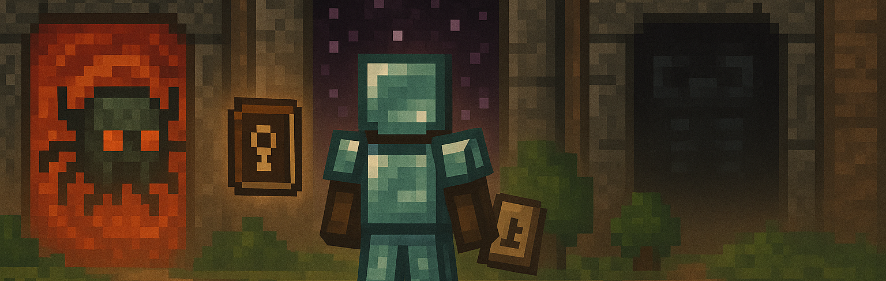

# Dimension Trials 💀

[](https://www.minecraft.net)



## **A challenging Minecraft mod that gates access to other dimensions behind specific achievements and mob elimination goals, forcing players to fully explore and master each dimension before progressing further.**

## 🌟 Key Features

### 🚪 **Dimensional Gating System**
- **Phase 1 - THE NETHER:** Blocks Nether access until Overworld challenges are completed
- **Phase 2 - THE END:** Requires Phase 1 completion plus high-level Nether objectives
- **Progressive Difficulty:** Each phase builds upon the previous one

### 📊 **HUD System**
- **Press `J`** to open an elegant real-time progression HUD
- **Multi-tab Interface:** Organized sections for each phase and objective type
- **Live Progress Tracking:** Visual indicators (✔ completed, ❌ pending) with counters
- **Mob Kill Tracking:** Detailed counters for all required mob eliminations
- **Sound Effects:** Immersive audio feedback for all interactions

### ⚔️ **Comprehensive Mob Elimination Goals**
- **Phase 1:** 17 different Overworld mob types to defeat
- **Phase 2:** 8 new Nether mob types + increased Overworld requirements
- **Smart Reset System:** Phase 2 requires 125% of Phase 1 Overworld mobs
- **Fully Configurable:** Every mob count can be adjusted via server config

### ⚙️ **Highly Configurable**
- **Individual Toggles:** Enable/disable any requirement independently
- **Scalable Difficulty:** Adjust mob kill requirements from 0 to 500+ per type
- **Phase Control:** Each phase can be completely disabled if desired
- **Multiplier System:** Optional mob health/damage increases after phase completion

### 🎮 **Enhanced User Experience**
- **Dual Interface:** Modern HUD + classic Progression Book for compatibility
- **Pagination Support:** Navigate through extensive requirements easily
- **Real-time Updates:** Progress syncs instantly across all players
- **Global Announcements:** Server-wide notifications when phases unlock

## 🎯 Progression Phases & Requirements

### Phase 1 - THE NETHER 🔥 (Unlock access to the Nether)
*All requirements below can be individually enabled/disabled in the server config*

#### 🎖️ Special Objectives:
* 🌊 **Defeat Elder Guardian:** Find and defeat an Elder Guardian in an Ocean Monument
* 🏆 **Win a Raid:** Successfully defend a village from a Pillager raid
* 🔑 **Trial Vault Advancement:** Complete a Trial Chamber and earn the "Under Lock and Key" advancement

#### ⚔️ Mob Elimination Goals (DEFAULT):

**👥 Common Mobs:**
* 🧟 **Zombies:** 50 kills
* 🧟 **Zombie Villagers:** 10 kills
* 💀 **Skeletons:** 40 kills
* 🏹 **Strays:** 15 kills
* 🏜 **Husks:** 15 kills
* 🕷 **Spiders:** 30 kills
* 💥 **Creepers:** 25 kills
* 🌊 **Drowned:** 20 kills

**⭐ Special Mobs:**
* 👤 **Endermen:** 10 kills
* 🧙 **Witches:** 8 kills
* 🏹 **Pillagers:** 15 kills
* 🚩 **Pillager Captains:** 3 kills
* ⚔ **Vindicators:** 5 kills
* 🏹 **Bogged:** 10 kills
* 💨 **Breezes:** 5 kills

**🎯 Goal Kills (Rare & Powerful):**
* 🐗 **Ravagers:** 3 kills
* 🔮 **Evokers:** 2 kills

---

### Phase 2 - THE END 🌌 (Unlock access to The End)
*Requires Phase 1 completion. All requirements below can be individually enabled/disabled*

#### 🎖️ Special Objectives:
* 💀 **Defeat Wither:** Summon and defeat the Wither boss
* 🌑 **Defeat Warden:** Awaken and defeat the Warden in the Deep Dark

#### ⚔️ Mob Elimination Goals (DEFAULT):

**🔥 Nether Mobs:**
* 🔥 **Blazes:** 20 kills
* 💀 **Wither Skeletons:** 15 kills
* 🐷 **Piglin Brutes:** 5 kills
* 🐗 **Hoglins:** 10 kills
* 💀 **Zoglins:** 5 kills
* 👻 **Ghasts:** 10 kills
* 🐛 **Endermites:** 5 kills
* 🐷 **Hostile Piglins:** 30 kills

## 🔧 Configuration

The mod creates detailed configuration files in your `config/` folder:

### Server Configuration (`dimtr-server.toml`)
- **Phase Toggles:** Enable/disable each phase independently
- **Special Objectives:** Toggle individual requirements (Elder Guardian, Raid, etc.)
- **Mob Kill Requirements:** Customize kill counts for every mob type (0-500+ range)
- **Multiplier System:** Optional mob health/damage increases after phase completion

### Client Configuration (`dimtr-client.toml`)
- **HUD Keybind:** Customize the progression HUD key (default: J)
- **Interface Settings:** Future client-side customization options

### Configuration Examples:
```toml
# Disable Phase 1 entirely (open Nether access)
enablePhase1 = false

# Reduce Zombie requirement to 25 kills
reqZombieKills = 25

# Disable Wither requirement for Phase 2
reqWither = false

# Enable 1.5x mob multiplier after Phase 1
enableMultipliers = true
phase1Multiplier = 1.5
```

## 🎮 How to Play

1. **Start Your World:** Begin normally in the Overworld
2. **Check Progress:** Press `J` to open the progression HUD
3. **Complete Phase 1:** Work through Overworld objectives and mob elimination
4. **Access Nether:** Becomes available once Phase 1 requirements are met
5. **Tackle Phase 2:** New Nether objectives plus increased Overworld requirements
6. **Unlock The End:** Complete Phase 2 to access the End dimension
7. **Enhanced Challenge:** Optional multipliers make mobs stronger after each phase

### Pro Tips:
- **Use the HUD:** The `J` key opens a comprehensive progress tracker
- **Plan Ahead:** Some mobs are rare - prepare accordingly
- **Server Config:** Admins can adjust difficulty for their community
- **Multiplayer Friendly:** Progress is global - work together!

## 🤝 Contributing

We welcome contributions! Feel free to:
- **Report bugs or suggest**: [GitHub Issues](https://github.com/II-mirai-II/Dimension-Trials/issues)
- Submit pull requests for improvements
- Share configuration presets for different server types
- Create community content or tutorials

---

**Made with ❤️ for the Minecraft community**

*Perfect for survival servers looking to add meaningful progression challenges and extend gameplay time in each dimension!*